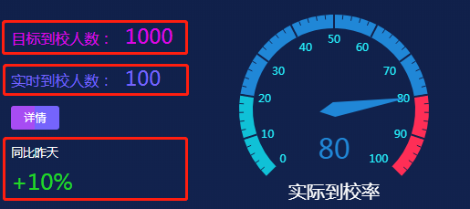
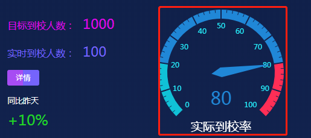
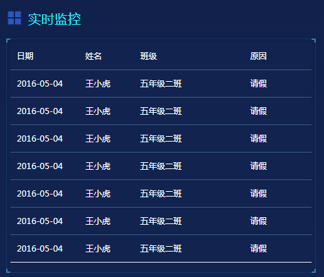

## 1. 考勤比率

### 1.1 功能描述

获取首页学生考勤模块的文字数据。<br>


### 1.2 请求说明

> 请求方式：get<br>
> 请求 URL ：[/index/percentToScholl](#)

### 1.3 请求参数

无参数

### 1.4 返回结果

```json
{
  "status": 200,
  "message": "",
  "data": {
    "percentObjData": {
      "total": {
        "text": "目标到校人数：",
        "data": 1000
      },
      "real": {
        "text": "实时到校人数：",
        "data": 100
      },
      "percent": {
        "text": "同比昨天",
        "data": "+10%"
      }
    }
  }
}
```

### 1.5 返回参数

| 字段    | 字段类型 | 字段说明       |
| ------- | -------- | -------------- |
| total   | object   | 目标到校人数   |
| real    | object   | 实时到校人数： |
| percent | object   | 实时到校比率   |
| text    | string   | 文字描述       |
| data    | string   | 数值/比率      |

### 1.6 错误状态码

参见 [全局响应状态码说明](../introduction.html/#134-全局响应状态码说明)

## 2. 考勤图表

### 2.1 功能描述

获取首页学生考勤模块的图表数据。<br>


### 2.2 请求说明

> 请求方式：get<br>
> 请求 URL ：[/index/rateToScholl](#)

### 2.3 请求参数

无参数

### 2.4 返回结果

```json
{
  "status": 200,
  "message": "",
  "data": {
    "chartData": {
      "columns": ["type", "value"],
      "rows": [{ "type": "实际到校率", "value": 80 }]
    },
    "vChartOptions": {
      "title": {
        "text": "实际到校率"
      }
    }
  }
}
```

### 2.5 返回参数

| 字段          | 字段类型 | 字段说明     |
| ------------- | -------- | ------------ |
| chartData     | object   | 图表数据     |
| vChartOptions | object   | 图表配置数据 |
| columns       | array    | 图表显示类型 |
| rows          | array    | 图表数据     |
| text          | string   | 图表标题     |

### 2.6 错误状态码

参见 [全局响应状态码说明](../introduction.html/#134-全局响应状态码说明)

## 3. 考勤异常统计

### 3.1 功能描述

获取首页学生考勤模块的表格数据。<br>


### 3.2 请求说明

> 请求方式：get<br>
> 请求 URL ：[/index/doorTableData](#)

### 3.3 请求参数

无参数

### 3.4 返回结果

```json
{
  "status": 200,
  "message": "",
  "data": {
    "tableData": [
      {
        "date": "2016-05-04",
        "name": "王小虎",
        "gradeClass": "五年级二班",
        "reason": "请假"
      },
      {
        "date": "2016-05-04",
        "name": "王小虎",
        "gradeClass": "五年级二班",
        "reason": "请假"
      },
      {
        "date": "2016-05-04",
        "name": "王小虎",
        "gradeClass": "五年级二班",
        "reason": "请假"
      },
      {
        "date": "2016-05-04",
        "name": "王小虎",
        "gradeClass": "五年级二班",
        "reason": "请假"
      },
      {
        "date": "2016-05-04",
        "name": "王小虎",
        "gradeClass": "五年级二班",
        "reason": "请假"
      },
      {
        "date": "2016-05-04",
        "name": "王小虎",
        "gradeClass": "五年级二班",
        "reason": "请假"
      },
      {
        "date": "2016-05-04",
        "name": "王小虎",
        "gradeClass": "五年级二班",
        "reason": "请假"
      }
    ]
  }
}
```

### 3.5 返回参数

| 字段       | 字段类型 | 字段说明  |
| ---------- | -------- | --------- |
| tableData  | array    | 表格数据  |
| date       | string   | 日期      |
| name       | string   | 姓名      |
| gradeClass | string   | 年级+班级 |
| reason     | string   | 原因      |

### 3.6 错误状态码

参见 [全局响应状态码说明](../introduction.html/#134-全局响应状态码说明)
