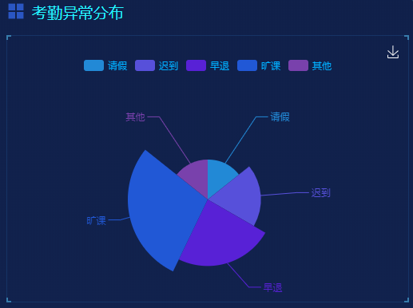
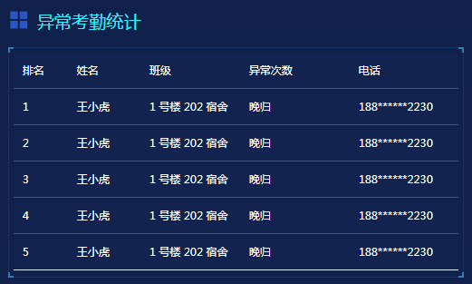
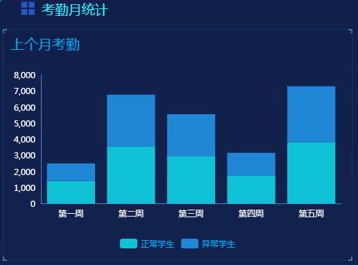
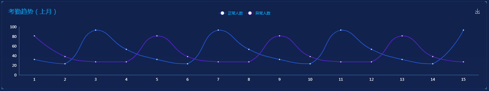

## 1. 考勤异常分布

### 1.1 功能描述

获取考勤模块的异常考勤数据。<br>


### 1.2 请求说明

> 请求方式：get<br>
> 请求 URL ：[/door/abnormalDormitoryPie](#)

### 1.3 请求参数

无参数

### 1.4 返回结果

```json
{
  "status": 200,
  "message": "",
  "data": {
    "chartData": {
      "columns": ["类型", "学生人数"],
      "rows": [
        { "类型": "请假", "学生人数": 30 },
        { "类型": "迟到", "学生人数": 40 },
        { "类型": "早退", "学生人数": 50 },
        { "类型": "旷课", "学生人数": 60 },
        { "类型": "其他", "学生人数": 30 }
      ]
    }
  }
}
```

### 1.5 返回参数

| 字段      | 字段类型 | 字段说明     |
| --------- | -------- | ------------ |
| chartData | object   | 图表数据     |
| columns   | array    | 图表显示类型 |
| rows      | array    | 图表数据     |

### 1.6 错误状态码

参见 [全局响应状态码说明](../introduction.html/#134-全局响应状态码说明)

## 2. 考勤异常统计

### 2.1 功能描述

获取考勤模块的表格数据。<br>


### 2.2 请求说明

> 请求方式：get<br>
> 请求 URL ：[/door/abnormalDoorTable](#)

### 2.3 请求参数

无参数

### 2.4 返回结果

```json
{
  "status": 200,
  "message": "",
  "data": {
    "tableData": [
      {
        "sort": "1",
        "name": "王小虎",
        "gradeClass": "1号楼202宿舍",
        "reason": "晚归",
        "tel": "188******2230"
      },
      {
        "sort": "2",
        "name": "王小虎",
        "gradeClass": "1号楼202宿舍",
        "reason": "晚归",
        "tel": "188******2230"
      },
      {
        "sort": "3",
        "name": "王小虎",
        "gradeClass": "1号楼202宿舍",
        "reason": "晚归",
        "tel": "188******2230"
      },
      {
        "sort": "4",
        "name": "王小虎",
        "gradeClass": "1号楼202宿舍",
        "reason": "晚归",
        "tel": "188******2230"
      },
      {
        "sort": "5",
        "name": "王小虎",
        "gradeClass": "1号楼202宿舍",
        "reason": "晚归",
        "tel": "188******2230"
      }
    ]
  }
}
```

### 2.5 返回参数

| 字段       | 字段类型 | 字段说明  |
| ---------- | -------- | --------- |
| tableData  | array    | 表格数据  |
| sort       | string   | 排序      |
| name       | string   | 姓名      |
| gradeClass | string   | 年级+班级 |
| reason     | string   | 原因      |
| tel        | string   | 电话      |

### 2.6 错误状态码

参见 [全局响应状态码说明](../introduction.html/#134-全局响应状态码说明)

## 3. 考勤月统计

### 3.1 功能描述

获取考勤模块的上个月统计数据。<br>


### 3.2 请求说明

> 请求方式：get<br>
> 请求 URL ：[/door/trendDoorHistogram](#)

### 3.3 请求参数

无参数

### 3.4 返回结果

```json
{
  "status": 200,
  "message": "",
  "data": {
    "chartData": {
      "columns": ["date", "正常学生", "异常学生"],
      "rows": [
        { "date": "第一周", "正常学生": 1393, "异常学生": 1093 },
        { "date": "第二周", "正常学生": 3530, "异常学生": 3230 },
        { "date": "第三周", "正常学生": 2923, "异常学生": 2623 },
        { "date": "第四周", "正常学生": 1723, "异常学生": 1423 },
        { "date": "第五周", "正常学生": 3792, "异常学生": 3492 }
      ]
    },
    "vChartOptions": {
      "title": {
        "text": "上个月考勤"
      },
      "xAxis": {
        "data": ["第一周", "第二周", "第三周", "第四周", "第五周"]
      }
    }
  }
}
```

### 3.5 返回参数

| 字段          | 字段类型 | 字段说明     |
| ------------- | -------- | ------------ |
| chartData     | object   | 图表数据     |
| columns       | array    | 图表显示类型 |
| rows          | array    | 图表数据     |
| vChartOptions | object   | 图表配置数据 |
| text          | string   | 图表标题     |
| data          | array    | 图表横坐标系 |

### 3.6 错误状态码

参见 [全局响应状态码说明](../introduction.html/#134-全局响应状态码说明)

## 4. 考勤趋势

### 4.1 功能描述

获取考勤模块的上个月统计数据。<br>


### 4.2 请求说明

> 请求方式：get<br>
> 请求 URL ：[/door/attendanceDoorLine](#)

### 4.3 请求参数

无参数

### 4.4 返回结果

```json
{
  "status": 200,
  "message": "",
  "data": {
    "chartData": {
      "columns": ["date", "正常人数", "异常人数"],
      "rows": [
        { "date": "1", "正常人数": 32, "异常人数": 81 },
        { "date": "2", "正常人数": 23, "异常人数": 38 },
        { "date": "3", "正常人数": 93, "异常人数": 27 },
        { "date": "4", "正常人数": 53, "异常人数": 27 },
        { "date": "5", "正常人数": 32, "异常人数": 81 },
        { "date": "6", "正常人数": 23, "异常人数": 38 },
        { "date": "7", "正常人数": 93, "异常人数": 27 },
        { "date": "8", "正常人数": 53, "异常人数": 27 },
        { "date": "9", "正常人数": 32, "异常人数": 81 },
        { "date": "10", "正常人数": 23, "异常人数": 38 },
        { "date": "11", "正常人数": 93, "异常人数": 27 },
        { "date": "12", "正常人数": 53, "异常人数": 27 },
        { "date": "13", "正常人数": 32, "异常人数": 81 },
        { "date": "14", "正常人数": 23, "异常人数": 38 },
        { "date": "15", "正常人数": 93, "异常人数": 27 }
      ]
    },
    "vChartOptions": {
      "title": {
        "text": "考勤趋势（上月）"
      }
    }
  }
}
```

### 4.5 返回参数

| 字段          | 字段类型 | 字段说明     |
| ------------- | -------- | ------------ |
| chartData     | object   | 图表数据     |
| columns       | array    | 图表显示类型 |
| rows          | array    | 图表数据     |
| vChartOptions | object   | 图表配置数据 |
| text          | string   | 图表标题     |

### 4.6 错误状态码

参见 [全局响应状态码说明](../introduction.html/#134-全局响应状态码说明)
