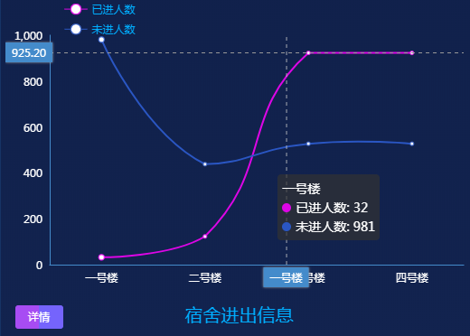

## 1. 进出宿舍

### 1.1 功能描述

获取首页学生进出宿舍的图表数据。<br>


### 1.2 请求说明

> 请求方式：get<br>
> 请求 URL ：[/index/dormitoryLineData](#)

### 1.3 请求参数

无参数

### 1.4 返回结果

```json
{
  "status": 200,
  "message": "",
  "data": {
    "chartData": {
      "columns": ["date", "已进人数", "未进人数"],
      "rows": [
        { "date": "一号楼", "已进人数": 32, "未进人数": 981 },
        { "date": "二号楼", "已进人数": 123, "未进人数": 438 },
        { "date": "三号楼", "已进人数": 923, "未进人数": 527 },
        { "date": "四号楼", "已进人数": 923, "未进人数": 527 }
      ]
    },
    "vChartOptions": {
      "title": {
        "text": "宿舍进出信息"
      }
    }
  }
}
```

### 1.5 返回参数

| 字段          | 字段类型 | 字段说明     |
| ------------- | -------- | ------------ |
| chartData     | object   | 图表数据     |
| vChartOptions | object   | 图表配置数据 |
| columns       | array    | 图表显示类型 |
| rows          | array    | 图表数据     |
| text          | string   | 图表标题     |

### 1.6 错误状态码

参见 [全局响应状态码说明](../introduction.html/#134-全局响应状态码说明)
