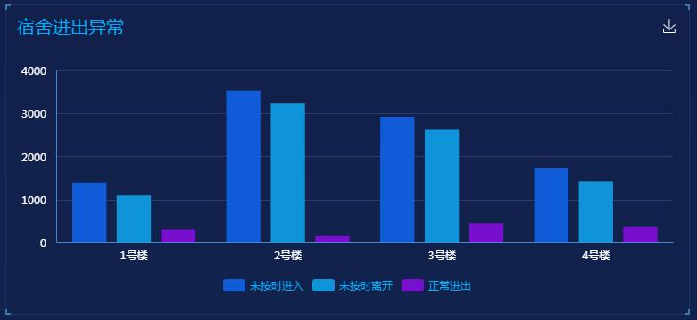
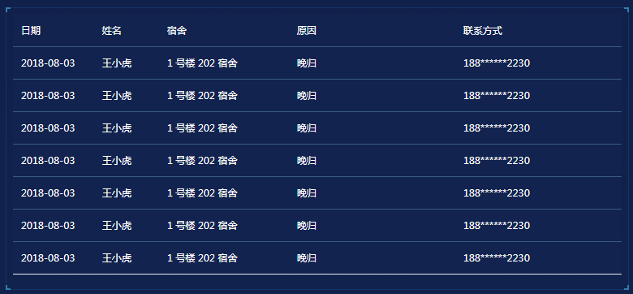
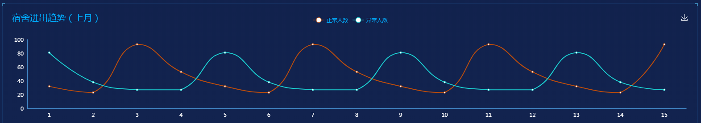

## 1. 宿舍进出异常

### 1.1 功能描述

获取宿舍管理模块的异常考勤数据。<br>


### 1.2 请求说明

> 请求方式：get<br>
> 请求 URL ：[/dormitory/dormitoryBar](#)

### 1.3 请求参数

无参数

### 1.4 返回结果

```json
{
  "status": 200,
  "message": "",
  "data": {
    "chartData": {
      "columns": ["楼", "未按时进入", "未按时离开", "正常进出"],
      "rows": [
        {
          "楼": "一号楼",
          "未按时进入": 1393,
          "未按时离开": 1093,
          "正常进出": 300
        },
        {
          "楼": "二号楼",
          "未按时进入": 3530,
          "未按时离开": 3230,
          "正常进出": 150
        },
        {
          "楼": "三号楼",
          "未按时进入": 2923,
          "未按时离开": 2623,
          "正常进出": 450
        },
        {
          "楼": "四号楼",
          "未按时进入": 1723,
          "未按时离开": 1423,
          "正常进出": 360
        }
      ]
    },
    "vChartOptions": {
      "title": {
        "text": "宿舍进出异常"
      }
    }
  }
}
```

### 1.5 返回参数

| 字段          | 字段类型 | 字段说明     |
| ------------- | -------- | ------------ |
| chartData     | object   | 图表数据     |
| columns       | array    | 图表显示类型 |
| rows          | array    | 图表数据     |
| vChartOptions | object   | 图表配置数据 |
| text          | string   | 图表标题     |

### 1.6 错误状态码

参见 [全局响应状态码说明](../introduction.html/#134-全局响应状态码说明)

## 2. 宿舍进出异常统计

### 2.1 功能描述

获取宿舍管理模块的表格数据。<br>


### 2.2 请求说明

> 请求方式：get<br>
> 请求 URL ：[/dormitory/dormitoryTable](#)

### 2.3 请求参数

无参数

### 2.4 返回结果

```json
{
  "status": 200,
  "message": "",
  "data": {
    "tableData": [
      {
        "date": "2018-08-03",
        "name": "王小虎",
        "gradeClass": "1号楼202宿舍",
        "reason": "晚归",
        "tel": "188******2230"
      },
      {
        "date": "2018-08-03",
        "name": "王小虎",
        "gradeClass": "1号楼202宿舍",
        "reason": "晚归",
        "tel": "188******2230"
      },
      {
        "date": "2018-08-03",
        "name": "王小虎",
        "gradeClass": "1号楼202宿舍",
        "reason": "晚归",
        "tel": "188******2230"
      },
      {
        "date": "2018-08-03",
        "name": "王小虎",
        "gradeClass": "1号楼202宿舍",
        "reason": "晚归",
        "tel": "188******2230"
      },
      {
        "date": "2018-08-03",
        "name": "王小虎",
        "gradeClass": "1号楼202宿舍",
        "reason": "晚归",
        "tel": "188******2230"
      },
      {
        "date": "2018-08-03",
        "name": "王小虎",
        "gradeClass": "1号楼202宿舍",
        "reason": "晚归",
        "tel": "188******2230"
      },
      {
        "date": "2018-08-03",
        "name": "王小虎",
        "gradeClass": "1号楼202宿舍",
        "reason": "晚归",
        "tel": "188******2230"
      }
    ]
  }
}
```

### 2.5 返回参数

| 字段       | 字段类型 | 字段说明    |
| ---------- | -------- | ----------- |
| tableData  | array    | 表格数据    |
| date       | string   | 日期        |
| name       | string   | 姓名        |
| gradeClass | string   | 楼号+宿舍号 |
| reason     | string   | 原因        |
| tel        | string   | 电话        |

### 2.6 错误状态码

参见 [全局响应状态码说明](../introduction.html/#134-全局响应状态码说明)

## 3. 考勤趋势

### 3.1 功能描述

获取宿舍管理模块的上个月进出统计数据。<br>


### 3.2 请求说明

> 请求方式：get<br>
> 请求 URL ：[/dormitory/dormitoryLine](#)

### 3.3 请求参数

无参数

### 3.4 返回结果

```json
{
  "status": 200,
  "message": "",
  "data": {
    "chartData": {
      "columns": ["date", "正常人数", "异常人数"],
      "rows": [
        { "date": "1", "正常人数": 32, "异常人数": 81 },
        { "date": "2", "正常人数": 23, "异常人数": 38 },
        { "date": "3", "正常人数": 93, "异常人数": 27 },
        { "date": "4", "正常人数": 53, "异常人数": 27 },
        { "date": "5", "正常人数": 32, "异常人数": 81 },
        { "date": "6", "正常人数": 23, "异常人数": 38 },
        { "date": "7", "正常人数": 93, "异常人数": 27 },
        { "date": "8", "正常人数": 53, "异常人数": 27 },
        { "date": "9", "正常人数": 32, "异常人数": 81 },
        { "date": "10", "正常人数": 23, "异常人数": 38 },
        { "date": "11", "正常人数": 93, "异常人数": 27 },
        { "date": "12", "正常人数": 53, "异常人数": 27 },
        { "date": "13", "正常人数": 32, "异常人数": 81 },
        { "date": "14", "正常人数": 23, "异常人数": 38 },
        { "date": "15", "正常人数": 93, "异常人数": 27 }
      ]
    },
    "vChartOptions": {
      "title": {
        "text": "宿舍进出趋势（上月）"
      }
    }
  }
}
```

### 3.5 返回参数

| 字段          | 字段类型 | 字段说明     |
| ------------- | -------- | ------------ |
| chartData     | object   | 图表数据     |
| columns       | array    | 图表显示类型 |
| rows          | array    | 图表数据     |
| vChartOptions | object   | 图表配置数据 |
| text          | string   | 图表标题     |

### 3.6 错误状态码

参见 [全局响应状态码说明](../introduction.html/#134-全局响应状态码说明)
