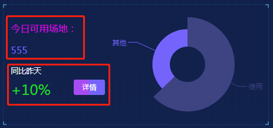
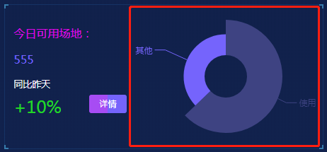

## 1. 场地数据

### 1.1 功能描述

获取首页场地预约模块的文字数据。<br>


### 1.2 请求说明

> 请求方式：get<br>
> 请求 URL ：[/index/percentToField](#)

### 1.3 请求参数

无参数

### 1.4 返回结果

```json
{
  "status": 200,
  "message": "",
  "data": {
    "percentObjData": {
      "available": {
        "text": "今日可用场地：",
        "data": 555
      },
      "percent": {
        "text": "同比昨天",
        "data": "+10%"
      }
    }
  }
}
```

### 1.5 返回参数

| 字段           | 字段类型 | 字段说明     |
| -------------- | -------- | ------------ |
| percentObjData | object   | 可用场地     |
| percent        | object   | 可用场地比率 |
| text           | string   | 文字描述     |
| data           | string   | 数值/比率    |

### 1.6 错误状态码

参见 [全局响应状态码说明](../introduction.html/#134-全局响应状态码说明)

## 2. 场地图表

### 2.1 功能描述

获取首页场地预约模块的图表数据。<br>


### 2.2 请求说明

> 请求方式：get<br>
> 请求 URL ：[/index/fieldRingData](#)

### 2.3 请求参数

无参数

### 2.4 返回结果

```json
{
  "status": 200,
  "message": "",
  "data": {
    "chartData": {
      "columns": ["场地", "场地数"],
      "rows": [
        { "场地": "其它", "场地数": 13 },
        { "场地": "使用", "场地数": 22 }
      ]
    }
  }
}
```

### 2.5 返回参数

| 字段      | 字段类型 | 字段说明     |
| --------- | -------- | ------------ |
| chartData | object   | 图表数据     |
| columns   | array    | 图表显示类型 |
| rows      | array    | 图表数据     |

### 2.6 错误状态码

参见 [全局响应状态码说明](../introduction.html/#134-全局响应状态码说明)
