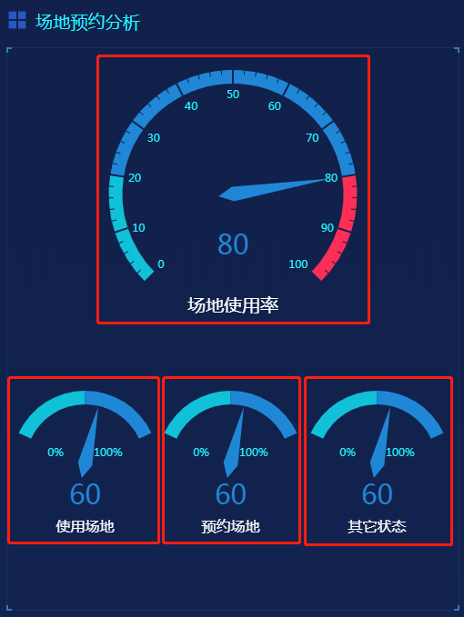
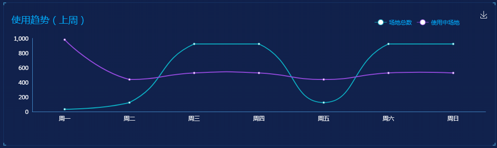
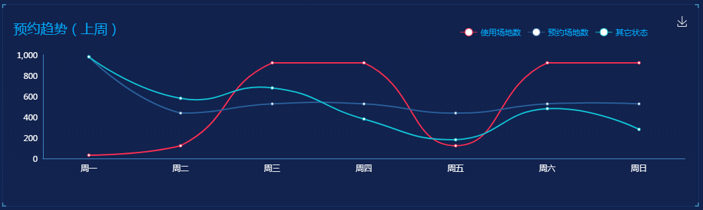

## 1. 场地预约分析

### 1.1 功能描述

获取场地管理模块的数据。<br>


### 1.2 请求说明

> 请求方式：get<br>
> 请求 URL ：[/field/useField](#)

### 1.3 请求参数

无参数

### 1.4 返回结果

```json
{
  "status": 200,
  "message": "",
  "data": {
    "useFieldPercent": {
      "chartData": {
        "columns": ["type", "value"],
        "rows": [{ "type": "场地使用率", "value": 80 }]
      },
      "vChartOptions": {
        "title": {
          "text": "场地使用率"
        }
      }
    },
    "useField": {
      "chartData": {
        "columns": ["type", "value"],
        "rows": [{ "type": "使用场地", "value": 60 }]
      },
      "vChartOptions": {
        "title": {
          "text": "使用场地"
        }
      }
    },
    "orderField": {
      "chartData": {
        "columns": ["type", "value"],
        "rows": [{ "type": "预约场地", "value": 60 }]
      },
      "vChartOptions": {
        "title": {
          "text": "预约场地"
        }
      }
    },
    "otherField": {
      "chartData": {
        "columns": ["type", "value"],
        "rows": [{ "type": "其它状态", "value": 60 }]
      },
      "vChartOptions": {
        "title": {
          "text": "其它状态"
        }
      }
    }
  }
}
```

### 1.5 返回参数

| 字段            | 字段类型 | 字段说明     |
| --------------- | -------- | ------------ |
| useFieldPercent | object   | 场地使用率   |
| useField        | object   | 使用场地     |
| orderField      | object   | 预约场地     |
| otherField      | object   | 其他场地     |
| chartData       | object   | 图表数据     |
| columns         | array    | 图表显示类型 |
| rows            | array    | 图表数据     |

### 1.6 错误状态码

参见 [全局响应状态码说明](../introduction.html/#134-全局响应状态码说明)

## 2. 车辆使用趋势

### 2.1 功能描述

获取场地管理模块的使用数据。<br>


### 2.2 请求说明

> 请求方式：get<br>
> 请求 URL ：[/field/useTrendFieldLine](#)

### 2.3 请求参数

无参数

### 2.4 返回结果

```json
{
  "status": 200,
  "message": "",
  "data": {
    "chartData": {
      "columns": ["date", "场地总数", "使用中场地"],
      "rows": [
        { "date": "周一", "场地总数": 32, "使用中场地": 981 },
        { "date": "周二", "场地总数": 123, "使用中场地": 438 },
        { "date": "周三", "场地总数": 923, "使用中场地": 527 },
        { "date": "周四", "场地总数": 923, "使用中场地": 527 },
        { "date": "周五", "场地总数": 123, "使用中场地": 438 },
        { "date": "周六", "场地总数": 923, "使用中场地": 527 },
        { "date": "周日", "场地总数": 923, "使用中场地": 527 }
      ]
    },
    "vChartOptions": {
      "title": {
        "text": "使用趋势（上周）"
      }
    }
  }
}
```

### 2.5 返回参数

| 字段          | 字段类型 | 字段说明     |
| ------------- | -------- | ------------ |
| chartData     | object   | 图表数据     |
| columns       | array    | 图表显示类型 |
| rows          | array    | 图表数据     |
| vChartOptions | object   | 图表配置数据 |
| text          | string   | 图表标题     |

### 2.6 错误状态码

参见 [全局响应状态码说明](../introduction.html/#134-全局响应状态码说明)

## 3. 场地预约趋势

### 3.1 功能描述

获取场地管理模块的预约数据。<br>


### 3.2 请求说明

> 请求方式：get<br>
> 请求 URL ：[/field/orderTrendFieldLine](#)

### 3.3 请求参数

无参数

### 3.4 返回结果

```json
{
  "status": 200,
  "message": "",
  "data": {
    "chartData": {
      "columns": ["date", "使用场地数", "预约场地数", "其它状态"],
      "rows": [
        {
          "date": "周一",
          "使用场地数": 32,
          "预约场地数": 981,
          "其它状态": 981
        },
        {
          "date": "周二",
          "使用场地数": 123,
          "预约场地数": 438,
          "其它状态": 581
        },
        {
          "date": "周三",
          "使用场地数": 923,
          "预约场地数": 527,
          "其它状态": 681
        },
        {
          "date": "周四",
          "使用场地数": 923,
          "预约场地数": 527,
          "其它状态": 381
        },
        {
          "date": "周五",
          "使用场地数": 123,
          "预约场地数": 438,
          "其它状态": 181
        },
        {
          "date": "周六",
          "使用场地数": 923,
          "预约场地数": 527,
          "其它状态": 481
        },
        {
          "date": "周日",
          "使用场地数": 923,
          "预约场地数": 527,
          "其它状态": 281
        }
      ]
    },
    "vChartOptions": {
      "title": {
        "text": "预约趋势（上周）"
      }
    }
  }
}
```

### 3.5 返回参数

| 字段          | 字段类型 | 字段说明     |
| ------------- | -------- | ------------ |
| chartData     | object   | 图表数据     |
| columns       | array    | 图表显示类型 |
| rows          | array    | 图表数据     |
| vChartOptions | object   | 图表配置数据 |
| text          | string   | 图表标题     |

### 3.6 错误状态码

参见 [全局响应状态码说明](../introduction.html/#134-全局响应状态码说明)
