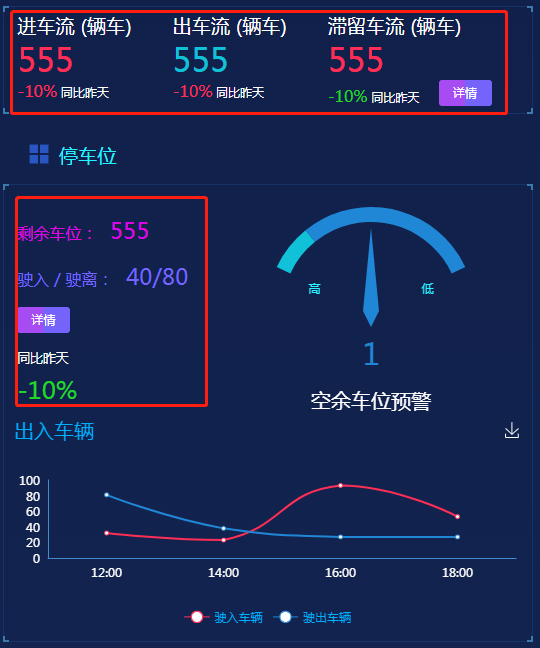
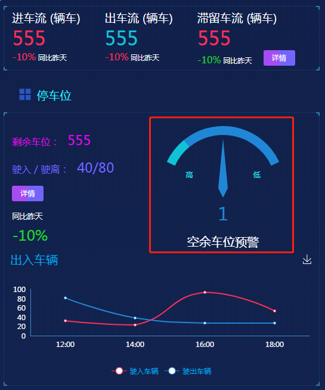
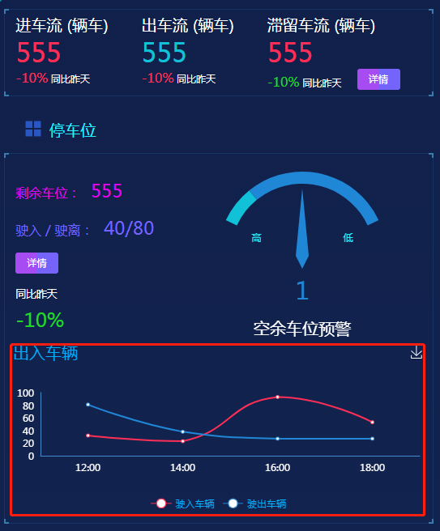

## 1. 车辆数据

### 1.1 功能描述

获取首页车辆管理模块的文字数据。<br>


### 1.2 请求说明

> 请求方式：get<br>
> 请求 URL ：[/index/percentToVehicle](#)

### 1.3 请求参数

无参数

### 1.4 返回结果

```json
{
  "status": 200,
  "message": "",
  "data": {
    "percentObjData": {
      "inVehicle": {
        "text": "进车流(辆车)",
        "data": 555
      },
      "percentInVehicle": {
        "text": "同比昨天",
        "data": "-10%"
      },
      "outVehicle": {
        "text": "出车流(辆车)",
        "data": 555
      },
      "percentOutVehicle": {
        "text": "同比昨天",
        "data": "-10%"
      },
      "retention": {
        "text": "滞留车流(辆车)",
        "data": 555
      },
      "percentRetention": {
        "text": "同比昨天",
        "data": "-10%"
      },
      "surplusPark": {
        "text": "剩余车位：",
        "data": 555
      },
      "inOutVehicle": {
        "text": "驶入/驶离：",
        "data": "40/80"
      },
      "percentInOutVehicle": {
        "text": "同比昨天",
        "data": "-10%"
      }
    }
  }
}
```

### 1.5 返回参数

| 字段                | 字段类型 | 字段说明              |
| ------------------- | -------- | --------------------- |
| inVehicle           | object   | 进车流                |
| percentInVehicle    | object   | 进车流比率            |
| outVehicle          | object   | 出车流                |
| percentOutVehicle   | object   | 出车流比率            |
| retention           | object   | 滞留车流              |
| percentRetention    | object   | 滞留车流比率          |
| surplusPark         | object   | 剩余车位              |
| inOutVehicle        | object   | 驶入/驶离（车辆）     |
| percentInOutVehicle | object   | 驶入/驶离（车辆）比率 |
| text                | string   | 文字描述              |
| data                | string   | 数值/比率             |

### 1.6 错误状态码

参见 [全局响应状态码说明](../introduction.html/#134-全局响应状态码说明)

## 2. 车位预警图表

### 2.1 功能描述

获取首页车辆管理模块的图表数据。<br>


### 2.2 请求说明

> 请求方式：get<br>
> 请求 URL ：[/index/rateVehicle](#)

### 2.3 请求参数

无参数

### 2.4 返回结果

```json
{
  "status": 200,
  "message": "",
  "data": {
    "chartData": {
      "columns": ["type", "value"],
      "rows": [{ "type": "空余车位预警", "value": 1 }]
    },
    "vChartOptions": {
      "title": {
        "text": "空余车位预警"
      }
    }
  }
}
```

### 2.5 返回参数

| 字段          | 字段类型 | 字段说明     |
| ------------- | -------- | ------------ |
| chartData     | object   | 图表数据     |
| vChartOptions | object   | 图表配置数据 |
| columns       | array    | 图表显示类型 |
| rows          | array    | 图表数据     |
| text          | string   | 图表标题     |

### 2.6 错误状态码

参见 [全局响应状态码说明](../introduction.html/#134-全局响应状态码说明)

## 3. 出入车辆统计

### 3.1 功能描述

获取首页车辆管理模块的折线图数据。<br>


### 3.2 请求说明

> 请求方式：get<br>
> 请求 URL ：[/index/vehicleLineData](#)

### 3.3 请求参数

无参数

### 3.4 返回结果

```json
{
  "status": 200,
  "message": "",
  "data": {
    "chartData": {
      "columns": ["date", "驶入车辆", "驶出车辆"],
      "rows": [
        { "date": "12:00", "驶入车辆": 32, "驶出车辆": 81 },
        { "date": "14:00", "驶入车辆": 23, "驶出车辆": 38 },
        { "date": "16:00", "驶入车辆": 93, "驶出车辆": 27 },
        { "date": "18:00", "驶入车辆": 53, "驶出车辆": 27 }
      ]
    },
    "vChartOptions": {
      "title": {
        "text": "出入车辆"
      }
    }
  }
}
```

### 3.5 返回参数

| 字段          | 字段类型 | 字段说明     |
| ------------- | -------- | ------------ |
| chartData     | object   | 图表数据     |
| vChartOptions | object   | 图表配置数据 |
| columns       | array    | 图表显示类型 |
| rows          | array    | 图表数据     |
| text          | string   | 图表标题     |

### 3.6 错误状态码

参见 [全局响应状态码说明](../introduction.html/#134-全局响应状态码说明)
