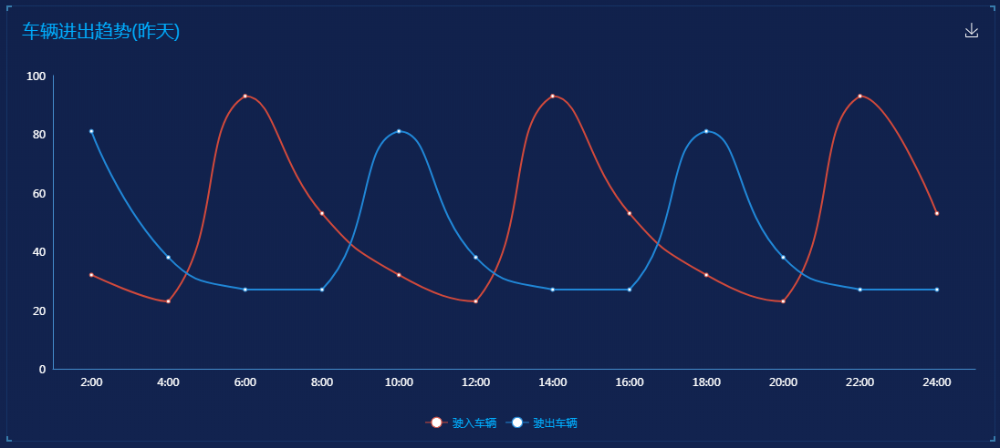

## 1. 车辆数据统计

### 1.1 功能描述

获取车辆管理模块的统计数据。<br>


### 1.2 请求说明

> 请求方式：get<br>
> 请求 URL ：[/vehicle/vehicleObjData](#)

### 1.3 请求参数

无参数

### 1.4 返回结果

```json
{
  "status": 200,
  "message": "",
  "data": {
    "totalVehicle": {
      "text": "总车辆(辆车)",
      "data": 555
    },
    "percentTotalVehicle": {
      "text": "同比昨天",
      "data": "-10%"
    },
    "teacherVehicle": {
      "text": "教职工车辆",
      "data": 555
    },
    "percentTeacherVehicle": {
      "text": "同比昨天",
      "data": "-10%"
    },
    "schoolVehicle": {
      "text": "校聘车辆",
      "data": 555
    },
    "percentSchoolVehicle": {
      "text": "同比昨天",
      "data": "-10%"
    },
    "publicVehicle": {
      "text": "公务车辆",
      "data": 555
    },
    "percentPublicVehicle": {
      "text": "同比昨天",
      "data": "-10%"
    },
    "otherVehicle": {
      "text": "其他车辆",
      "data": "40/80"
    },
    "percentOtherVehicle": {
      "text": "同比昨天",
      "data": "-10%"
    }
  }
}
```

### 1.5 返回参数

| 字段                  | 字段类型 | 字段说明   |
| --------------------- | -------- | ---------- |
| totalVehicle          | object   | 总车辆     |
| percentTotalVehicle   | object   | 比率       |
| teacherVehicle        | object   | 教职工车辆 |
| percentTeacherVehicle | object   | 比率       |
| schoolVehicle         | object   | 校聘车辆   |
| percentSchoolVehicle  | object   | 比率       |
| publicVehicle         | object   | 公务车辆   |
| percentPublicVehicle  | object   | 比率       |
| otherVehicle          | object   | 其他车辆   |
| percentOtherVehicle   | object   | 比率       |

### 1.6 错误状态码

参见 [全局响应状态码说明](../introduction.html/#134-全局响应状态码说明)

## 2. 车辆预警数据

### 2.1 功能描述

获取车辆管理模块的预警数据。<br>


### 2.2 请求说明

> 请求方式：get<br>
> 请求 URL ：[/vehicle/vehicleFunnel](#)

### 2.3 请求参数

无参数

### 2.4 返回结果

```json
{
  "status": 200,
  "message": "",
  "data": {
    "chartData": {
      "columns": ["状态", "数值"],
      "rows": [
        { "状态": "车辆警戒值", "数值": 900 },
        { "状态": "停车位总数", "数值": 600 },
        { "状态": "剩余停车位", "数值": 300 },
        { "状态": "历史平均值", "数值": 100 },
        { "状态": "平均值差值", "数值": 300 },
        { "状态": "总出校车辆", "数值": 100 }
      ]
    }
  }
}
```

### 2.5 返回参数

| 字段      | 字段类型 | 字段说明     |
| --------- | -------- | ------------ |
| chartData | object   | 图表数据     |
| columns   | array    | 图表显示类型 |
| rows      | array    | 图表数据     |

### 2.6 错误状态码

参见 [全局响应状态码说明](../introduction.html/#134-全局响应状态码说明)

## 3. 车辆进出趋势

### 3.1 功能描述

获取车辆管理模块的上个月进出统计数据。<br>


### 3.2 请求说明

> 请求方式：get<br>
> 请求 URL ：[/vehicle/trendVehicleLine](#)

### 3.3 请求参数

无参数

### 3.4 返回结果

```json
{
  "status": 200,
  "message": "",
  "data": {
    "chartData": {
      "columns": ["date", "驶入车辆", "驶出车辆"],
      "rows": [
        { "date": "2:00", "驶入车辆": 32, "驶出车辆": 81 },
        { "date": "4:00", "驶入车辆": 23, "驶出车辆": 38 },
        { "date": "6:00", "驶入车辆": 93, "驶出车辆": 27 },
        { "date": "8:00", "驶入车辆": 53, "驶出车辆": 27 },
        { "date": "10:00", "驶入车辆": 32, "驶出车辆": 81 },
        { "date": "12:00", "驶入车辆": 23, "驶出车辆": 38 },
        { "date": "14:00", "驶入车辆": 93, "驶出车辆": 27 },
        { "date": "16:00", "驶入车辆": 53, "驶出车辆": 27 },
        { "date": "18:00", "驶入车辆": 32, "驶出车辆": 81 },
        { "date": "20:00", "驶入车辆": 23, "驶出车辆": 38 },
        { "date": "22:00", "驶入车辆": 93, "驶出车辆": 27 },
        { "date": "24:00", "驶入车辆": 53, "驶出车辆": 27 }
      ]
    },
    "vChartOptions": {
      "title": {
        "text": "车辆进出趋势(昨天)"
      }
    }
  }
}
```

### 3.5 返回参数

| 字段          | 字段类型 | 字段说明     |
| ------------- | -------- | ------------ |
| chartData     | object   | 图表数据     |
| columns       | array    | 图表显示类型 |
| rows          | array    | 图表数据     |
| vChartOptions | object   | 图表配置数据 |
| text          | string   | 图表标题     |

### 3.6 错误状态码

参见 [全局响应状态码说明](../introduction.html/#134-全局响应状态码说明)
